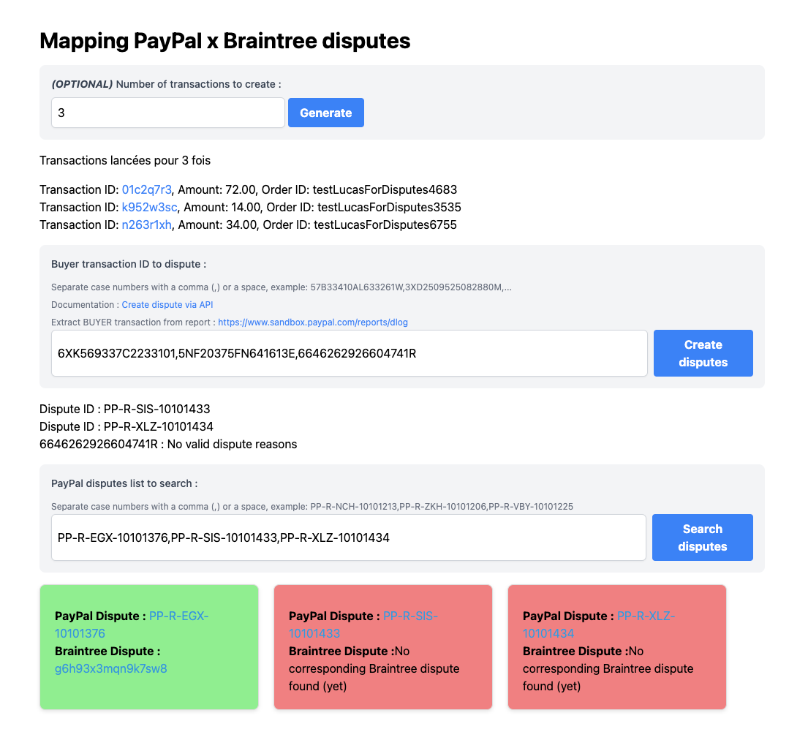

# Installation and Usage
## Prerequisites
* Node.js 14 or higher
* npm 7 or higher
* A PayPal & Dispute Sandbox account (for development purposes)
* A Braintree Payment Token (optional, for mass transaction create)

## Installation
1. Clone the Git repository: `git clone https://github.com/lugapi/PayPal-Braintree_map_disputes.git`
2. Run the following command to install dependencies: `npm install`

## Configuration
1. Copy the `.env.example` file into a new file named `.env`
2. Replace the default values with your own information:
	* `PAYPAL_CLIENT_ID`: your PayPal Sandbox client ID
	* `PAYPAL_CLIENT_SECRET`: your PayPal Sandbox client secret
	...
3. Ensure you have installed the Braintree library

## Usage
1. Run the following command to start the application: `npm start`
2. Use the "Create Transactions" button to generate transactions in batch
3. **USE A PAYMENT METHOD TOKEN TO CREATE TRANSACTIONS (BYPASSING FRONT-END MANAGEMENT)**

## Transaction Token
When creating a transaction, a token is generated and displayed in the console. This token can be used to retrieve transaction information.

## API REST
The API REST is available on port 3000 (default). You can use tools like Postman or cURL to interact with the API.

## Limitations and Constraints
* This application is not intended for production use.
* The transactions generated by this application are not real and cannot be paid.
