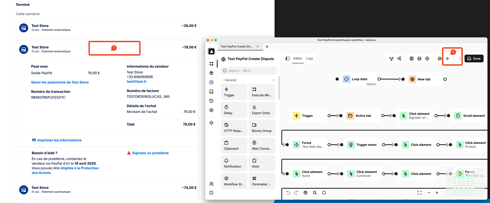

# Installation & Usage
1. Import the Automa json file 
2. Log on https://www.sandbox.paypal.com with the BUYER ACCOUNT and go on https://www.sandbox.paypal.com/resolutioncenter/filing/XXXXX (with XXXXX the Buyer Transaction ID) and click on the transaction to dispute
3. Start the Automa workflow